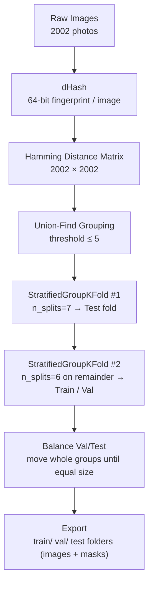
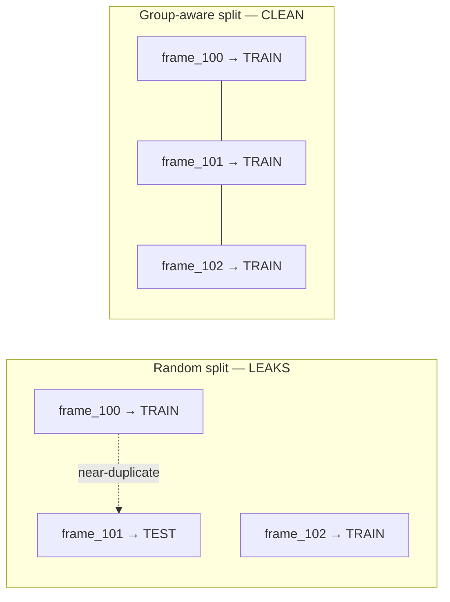
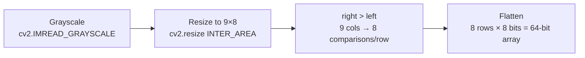
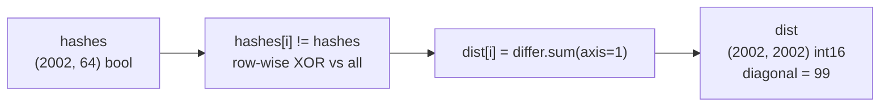
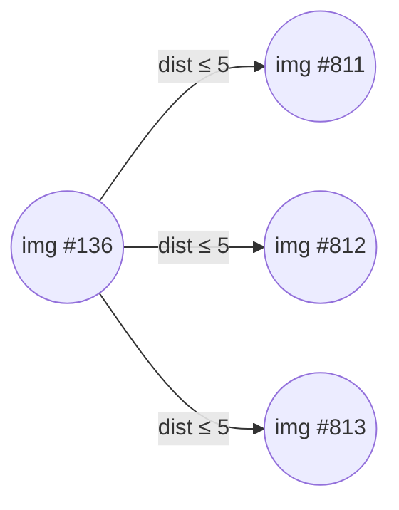
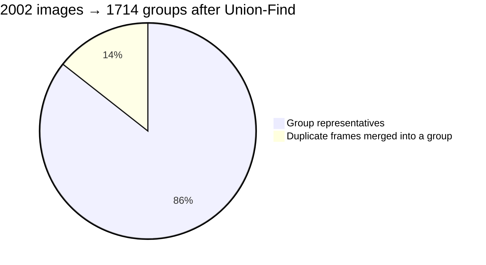
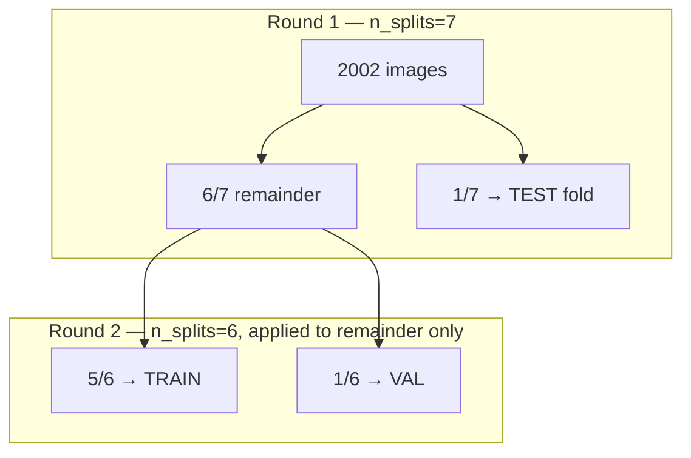
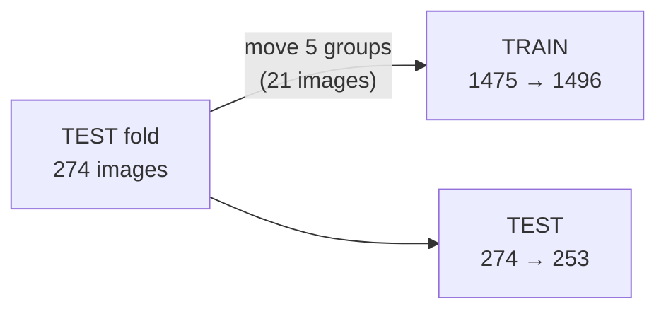
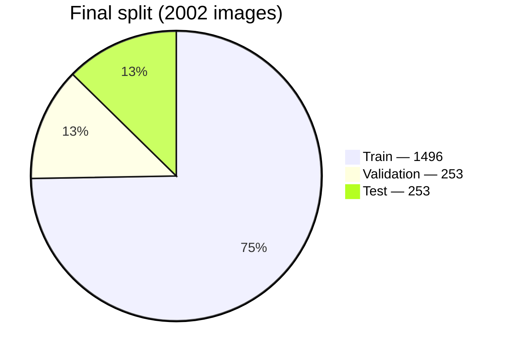

# Data Validation & Split Pipeline

Deduplicates near-identical frames and produces a leak-free train/val/test split for the
**FloPWD (Dal Lake Floating Plastic Waste Detection)** dataset.

## Quick facts

|                     |                                                                   |
| ------------------- | ----------------------------------------------------------------- |
| Input images        | 2002 (`Raw_Images/`, 1280×720, no EXIF → video frames)            |
| Fingerprint         | dHash, 64-bit                                                     |
| Duplicate threshold | Hamming distance ≤ 5                                              |
| Split method        | `StratifiedGroupKFold` (sklearn), 2 rounds + group-balancing pass |
| Final split         | **train 1496 · val 253 · test 253** (74.7% / 12.6% / 12.6%)       |
| Seed                | 42                                                                |

---

## 1. Pipeline overview



---

## 2. Why group-aware, not random



Frames 100/101/102 are the same lake, same trash, a fraction of a second apart. Random split
can tear the chain apart; group-aware split locks the whole chain to one side.

---

## 3. Step: dHash fingerprint (64-bit)



Real output for `img1.jpg` (first image, `hashes[0]`), 1 = brighter than left neighbor:

```
0 0 0 1 0 0 1 0
0 0 0 0 0 1 1 0
0 0 0 0 0 1 1 1
0 0 1 0 0 1 1 1
0 0 0 0 0 1 0 1
0 0 0 1 0 1 0 1
0 0 0 0 0 1 1 1
0 0 0 0 1 1 0 1
```

---

## 4. Step: Hamming distance matrix



---

## 5. Step: Union-Find grouping

Real chain found in the data — three pairs, one duplicate group:





---

## 6. Step: two-round `StratifiedGroupKFold`



---

## 7. Step: balance val/test

Fold sizes aren't equal by default — whole groups get handed back to train until val and test match.

```
Before balancing:  train 1475  val 253  test 274   (test is bigger, gap = 21)
Groups moved:       5 whole groups, 21 images, test → train
After balancing:   train 1496  val 253  test 253   (gap closed to 0)
```



---

## 8. Final result



| Split | Images | %     | Groups | has_plastic |
| ----- | ------ | ----- | ------ | ----------- |
| Train | 1496   | 74.7% | 1271   | 73.8%       |
| Val   | 253    | 12.6% | 200    | 74.7%       |
| Test  | 253    | 12.6% | 243    | 74.7%       |

```
Train  74.7% ███████████████████████████████████░░░░░░░░░░░░░
Val    12.6% ██████░░░░░░░░░░░░░░░░░░░░░░░░░░░░░░░░░░░░░░░░░░░
Test   12.6% ██████░░░░░░░░░░░░░░░░░░░░░░░░░░░░░░░░░░░░░░░░░░░
```

No group appears in more than one split — that's what makes the split leak-free.

---

## 9. Evidence this matters (literature)

Accuracy inflation caused by random (non-grouped) splitting, Yagis et al. (2021):

```
OASIS      +30%  ██████
ADNI       +29%  ██████
PPMI       +48%  ██████████
Versilia   +55%  ███████████
```

Random-label control experiment (label is unlearnable noise — correct score is 50%):

```
Slice-level split (leaked)     96%  ███████████████████
Subject-level split (grouped)  50%  ██████████
```

---

## References (APA 7)

Adimoolam, M., Poullis, C., & Averkiou, M. (2023). _Data leakage detection and de-duplication in
large scale geospatial image datasets_. arXiv. https://arxiv.org/abs/2304.02296

Barz, B., & Denzler, J. (2020). Do we train on test data? Purging CIFAR of near-duplicates.
_Journal of Imaging_, _6_(6), 41. https://doi.org/10.3390/jimaging6060041

Karasiak, N., Dejoux, J.-F., Monteil, C., & Sheeren, D. (2021). Spatial dependence between
training and test sets: Another pitfall of classification accuracy assessment in remote sensing.
_Machine Learning_, _111_(7), 2715–2740. https://doi.org/10.1007/s10994-021-05972-1

Kapoor, S., & Narayanan, A. (2023). Leakage and the reproducibility crisis in machine-learning-based
science. _Patterns_, _4_(9), Article 100804. https://doi.org/10.1016/j.patter.2023.100804

Tampu, I. E., Eklund, A., & Haj-Hosseini, N. (2022). Inflation of test accuracy due to data
leakage in deep learning-based classification of OCT images. _Scientific Data_, _9_, Article 580.
https://doi.org/10.1038/s41597-022-01618-6

Yagis, E., Atnafu, S. W., García Seco de Herrera, A., Marzi, C., Scheda, R., Giannelli, M., Tessa,
C., Citi, L., & Diciotti, S. (2021). Effect of data leakage in brain MRI classification using 2D
convolutional neural networks. _Scientific Reports_, _11_, Article 22544.
https://doi.org/10.1038/s41598-021-01681-w

Glazner, C. et al. (2025). _Find the leak, fix the split: Cluster-based method to prevent leakage
in video-derived datasets_. arXiv. https://arxiv.org/abs/2511.13944 — supplementary; abstract-only reference.
