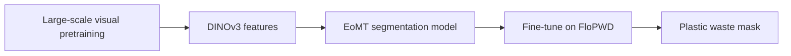
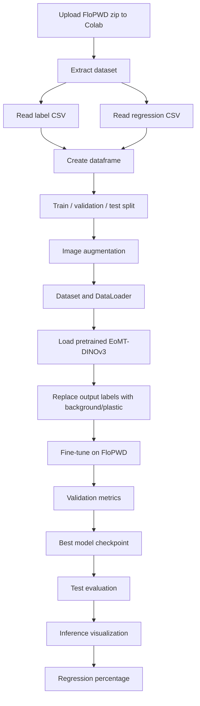
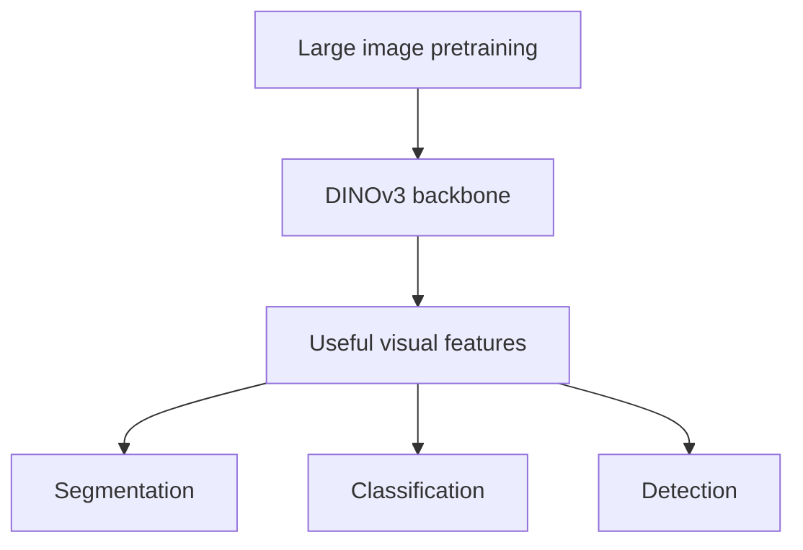
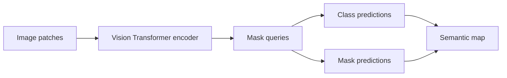
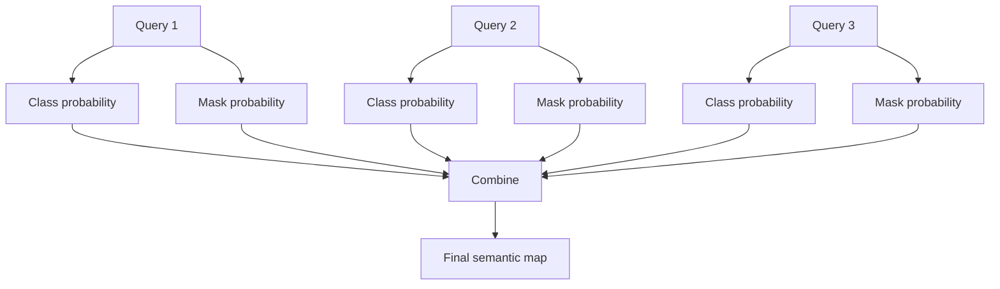
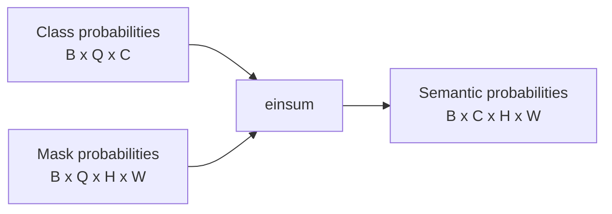
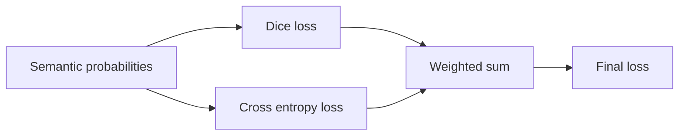
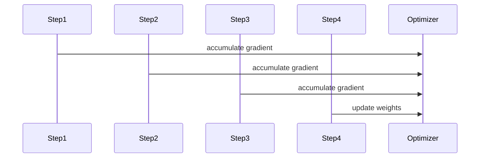
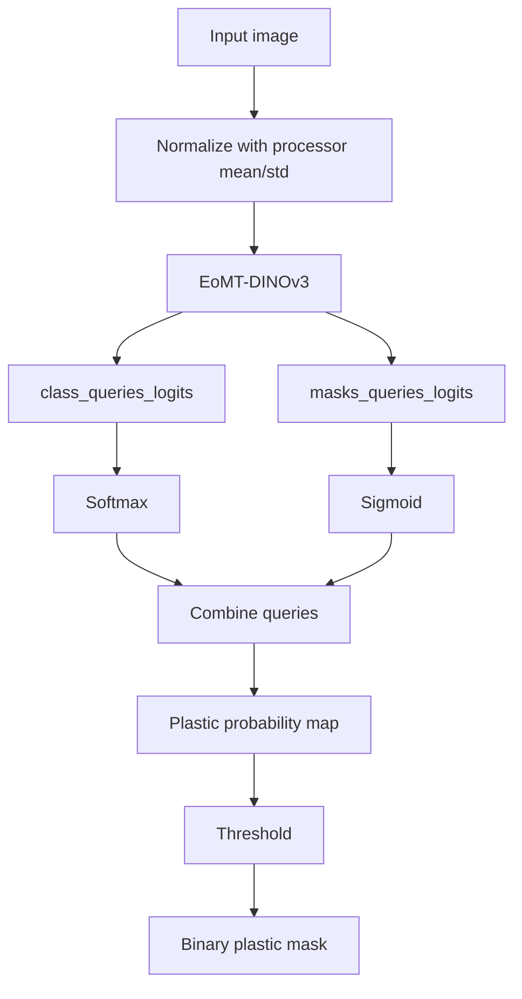
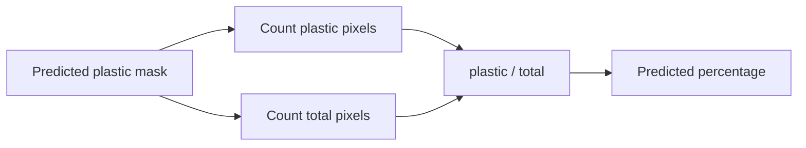

# EoMT-DINOv3 Pretrained Training Guide

This guide explains the notebook:

`THESIS_EOMT_DINOV3_PRETRAINED.ipynb`

The notebook fine-tunes a pretrained semantic segmentation model for the FloPWD 2025 plastic waste segmentation task.

The model used here is:

```text
tue-mps/eomt-dinov3-ade-semantic-large-512
```

This model combines:

| Component          | Meaning                                                      |
| ------------------ | ------------------------------------------------------------ |
| DINOv3             | A 2025 vision foundation model backbone                      |
| EoMT               | Encoder-only Mask Transformer for image segmentation         |
| ADE20K pretraining | Semantic segmentation pretraining on a large dataset         |
| FloPWD fine-tuning | Training the pretrained model for plastic waste segmentation |

## Simple Idea

DSAFNet in the other notebook is a new raw model trained from scratch.

This notebook is different.

It uses a model that already learned many visual patterns from large-scale pretraining.



In simple terms:

```text
DSAFNet raw = learn from zero
EoMT-DINOv3 pretrained = start from a model that already understands images
```

## Why Use EoMT-DINOv3?

DINOv3 was released in 2025 and is described by Hugging Face as a family of vision foundation models that produce high-quality dense features for many vision tasks [3].

EoMT is a segmentation model family from the paper **Your ViT is Secretly an Image Segmentation Model** [1].

The Hugging Face model used here is an EoMT-DINOv3 model already trained for ADE20K semantic segmentation [2].

That makes it a good pretrained SOTA-style comparison against raw DSAFNet.

| Model        | Training style             | Role in thesis                        |
| ------------ | -------------------------- | ------------------------------------- |
| DSAFNet 2026 | Raw from scratch           | New lightweight model                 |
| EoMT-DINOv3  | Pretrained then fine-tuned | Modern pretrained/foundation baseline |

## External Architecture Image

EoMT project figure:


Source: EoMT project page [1].

## Whole Notebook Pipeline

The notebook keeps the same structure as the SegFormer and DSAFNet notebooks.



## Dataset Output

The task is still binary semantic segmentation.

Every pixel is classified as:

| Class ID | Label      |
| -------- | ---------- |
| `0`      | Background |
| `1`      | Plastic    |


## Why The Notebook Uses Image Processor Mean and Std

For DSAFNet raw, we used simple `0..1` scaling.

For EoMT-DINOv3, the model is pretrained, so we should use the same image normalization style expected by the pretrained processor.

The notebook loads:

```python
processor = AutoImageProcessor.from_pretrained(MODEL_ID)
mean = processor.image_mean
std = processor.image_std
```

This is important because the pretrained model learned from images normalized in a specific way.

Simple analogy:

```text
If the pretrained model learned with one image format,
we should give new images in the same format.
```

## Model Loading

The notebook uses:

```python
model = EomtDinov3ForUniversalSegmentation.from_pretrained(
    MODEL_ID,
    num_labels=2,
    id2label=id2label,
    label2id=label2id,
    ignore_mismatched_sizes=True
)
```

What this means:

| Argument                       | Meaning                                               |
| ------------------------------ | ----------------------------------------------------- |
| `MODEL_ID`                     | Loads the pretrained EoMT-DINOv3 model                |
| `num_labels=2`                 | Changes task to background/plastic                    |
| `id2label`                     | Converts class IDs into readable labels               |
| `label2id`                     | Converts readable labels into class IDs               |
| `ignore_mismatched_sizes=True` | Allows the old ADE20K classifier shape to be replaced |

The backbone starts from pretrained weights.

The final classification part is adapted to the new binary task.

## What Is DINOv3?

DINOv3 is a vision foundation model.

It is not only trained for one small task. It learns general visual features that can help many computer vision tasks.



For this notebook, we use DINOv3 features for segmentation.

## What Is EoMT?

EoMT means Encoder-only Mask Transformer.

The main idea is that a Vision Transformer can be used for segmentation without a heavy traditional decoder.



Instead of directly outputting one mask, EoMT predicts:

| Output             | Meaning                               |
| ------------------ | ------------------------------------- |
| Class query logits | What class each query represents      |
| Mask query logits  | Where each query appears in the image |

The notebook combines these two outputs into a semantic segmentation map.

## Query-Based Segmentation

Traditional segmentation models often output:

```text
B x C x H x W
```

For example:

```text
batch x classes x height x width
```

EoMT-style models output something more like:

```text
class query logits = B x Q x C
mask query logits  = B x Q x H x W
```

Where:

| Symbol | Meaning                       |
| ------ | ----------------------------- |
| `B`    | Batch size                    |
| `Q`    | Number of object/mask queries |
| `C`    | Number of classes             |
| `H`    | Height                        |
| `W`    | Width                         |



## How The Notebook Converts Queries Into Semantic Probability

The key function is:

```python
def eomt_forward(model, images, target_size):
```

Inside it:

```python
outputs = model(pixel_values=images)

class_logits = outputs.class_queries_logits
mask_logits = outputs.masks_queries_logits
```

Then:

```python
class_probs = torch.softmax(class_logits, dim=-1)
mask_probs = torch.sigmoid(mask_logits)
```

Meaning:

| Tensor         | Conversion | Meaning                   |
| -------------- | ---------- | ------------------------- |
| `class_logits` | softmax    | query class probabilities |
| `mask_logits`  | sigmoid    | query mask probabilities  |

Then the notebook combines them:

```python
semantic_probs = torch.einsum("bqc,bqhw->bchw", class_probs, mask_probs)
```

Beginner meaning:

```text
For each query:
    class probability says what it is
    mask probability says where it is

Combine all queries:
    get final class probability for every pixel
```



For this task:

```text
C = 2
class 0 = background
class 1 = plastic
```

## Why The Model Output Is Normalized Again

After combining query masks, the notebook does:

```python
semantic_probs = semantic_probs / semantic_probs.sum(dim=1, keepdim=True).clamp_min(1e-6)
```

This makes class probabilities more stable.

For each pixel:

```text
background probability + plastic probability = about 1
```

That makes the loss easier to calculate.

## Loss Function

The notebook uses:

```text
final loss = 0.7 * Dice loss + 0.3 * Cross Entropy loss
```



### Dice Loss

Dice loss focuses on overlap between predicted plastic mask and real plastic mask.

It is useful because plastic pixels may be much fewer than background pixels.

### Cross Entropy Loss

Cross entropy helps each pixel learn the correct class.

The notebook adds class weights:

```python
class_weights = torch.tensor([1.0, min(pos_weight, 50.0)])
```

This gives more importance to plastic pixels when they are rare.

## Training Settings

The model is heavy, so the notebook uses:

| Setting            | Value  |
| ------------------ | ------ |
| `BATCH_SIZE`       | `1`    |
| `GRAD_ACCUM_STEPS` | `4`    |
| `IMAGE_HEIGHT`     | `512`  |
| `IMAGE_WIDTH`      | `512`  |
| Learning rate      | `1e-5` |

Gradient accumulation means:

```text
Instead of using batch size 4 directly,
we run 4 small batches of size 1,
then update the model once.
```



This is useful when GPU memory is limited.

## Metrics

The notebook reports:

| Metric         | Meaning                                       |
| -------------- | --------------------------------------------- |
| Foreground IoU | Plastic area overlap                          |
| Background IoU | Background area overlap                       |
| mIoU           | Average of foreground and background IoU      |
| Dice           | Mask overlap                                  |
| Precision      | How many predicted plastic pixels are correct |
| Recall         | How many actual plastic pixels are found      |

## Best Threshold

The model outputs plastic probability.

The threshold decides when a pixel becomes plastic.

```text
if plastic probability > threshold:
    plastic
else:
    background
```

The notebook searches thresholds from `0.10` to `0.90` and chooses the best validation Dice score.

## Inference Flow



## Regression Percentage

The regression percentage is calculated from the segmentation mask.

```text
predicted percentage = predicted plastic pixels / total pixels * 100
```

This means there is no separate regression neural network.

The segmentation model predicts the mask, then the notebook calculates percentage.



The result is saved as:

```text
/content/flopwd_eomt_dinov3_regression_percentages.csv
```

## Drone Deployment Note

EoMT-DINOv3 is much heavier than DSAFNet.

It is good as a pretrained SOTA comparison, but it may be too heavy for small drones.

For drone use:

| Option                                  | Practicality       |
| --------------------------------------- | ------------------ |
| Run EoMT-DINOv3 directly on small drone | Difficult          |
| Run on NVIDIA Jetson Orin               | Possible but heavy |
| Run on ground station/server            | More practical     |
| Use DSAFNet on drone                    | More lightweight   |
| Use EoMT-DINOv3 to create better labels | Very useful        |

Practical thesis framing:

```text
DSAFNet = lightweight deployment candidate
EoMT-DINOv3 = pretrained SOTA comparison
```

## References

[1] Tommie Kerssies, Niccolo Cavagnero, Alexander Hermans, Narges Norouzi, Giuseppe Averta, Bastian Leibe, Gijs Dubbelman, and Daan de Geus. "Your ViT is Secretly an Image Segmentation Model." CVPR, 2025. Project page: https://www.tue-mps.org/eomt/

[2] Hugging Face model card. `tue-mps/eomt-dinov3-ade-semantic-large-512`. https://huggingface.co/tue-mps/eomt-dinov3-ade-semantic-large-512

[3] Hugging Face Transformers Documentation. "DINOv3." https://huggingface.co/docs/transformers/model_doc/dinov3

[4] Hugging Face Transformers Documentation. "EoMT-DINOv3." https://huggingface.co/docs/transformers/model_doc/eomt_dinov3
